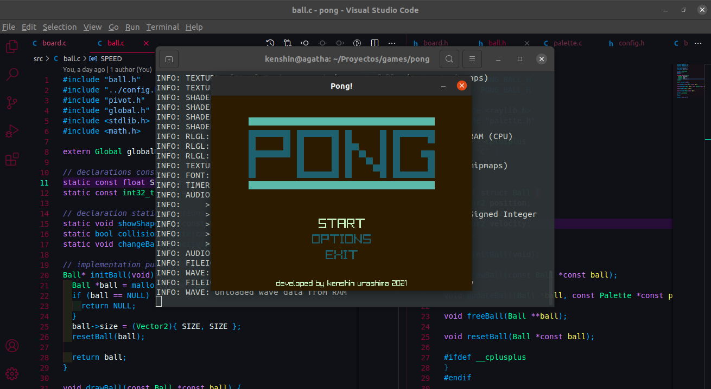
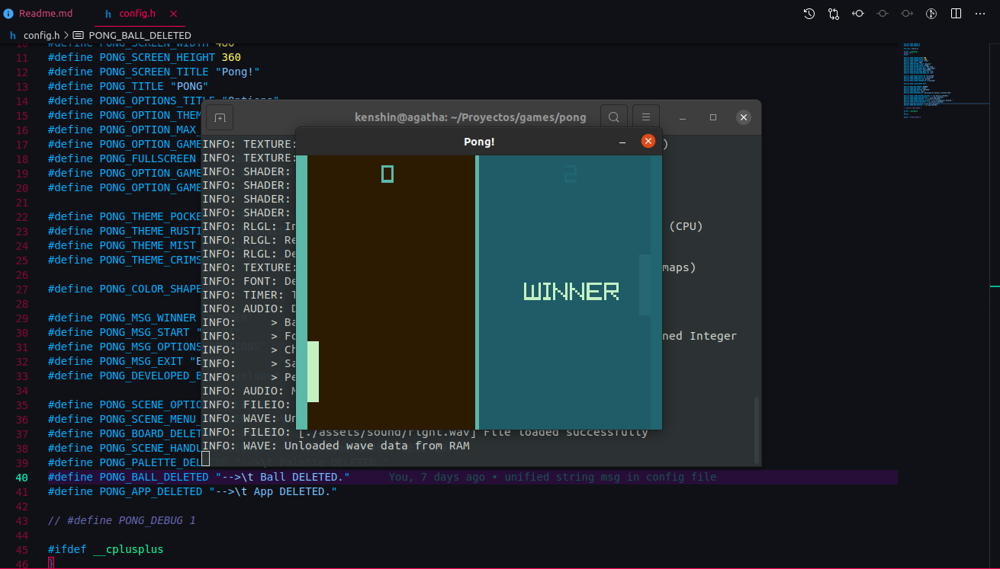

# Pong Game.

## Description.

This is my first game finished with [Raylib](https://www.raylib.com/) library and *C* language, is cool when you can finish a project, even small project like this. begin is easy but finishe is other thing.

My game has three main windows, all files window are in *scenes* folder, also I will explain every window. the windows are *Menu*, *Board* and *Options*

### Menu

The *Menu*, here there are some options, **start**, **options** (here are all options to configuration) and **exit**. When we pressed the *start* option, will get begun the game, if we pressed *options* we would go to *Options* window, if we pressed *exit* will get finished the game.

### Options

Here there is some options for modified the game config like max points, the theme, game mode (there are two mode PvP and PvE), and as well you can change fullscreen mode.

### Board

Here is the game, at left section is player palette, en right section is enemy palette.

When someone win a blue screen appears front to winner.

